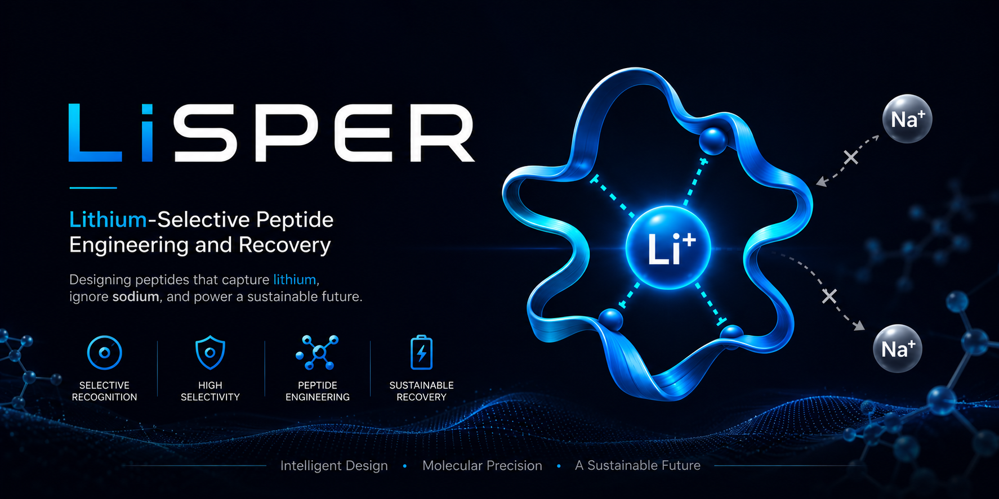

<p align="center">
  
</p>

<h1 align="center">LiSPER Dashboard</h1>

<p align="center">
  Public progress monitor for the LiSPER lithium-selective peptide discovery program.
</p>

<p align="center">
  <a href="https://jackyissocute.github.io/LiSPER-Dashboard/"><strong>Open the live dashboard</strong></a>
  ·
  <a href="https://github.com/jackyissocute/LiSPER">Main LiSPER repository</a>
</p>

<p align="center">
  
  
  
</p>

## What This Is

LiSPER Dashboard is the public-facing progress display for the LiSPER project. It translates the active computational discovery workflow into three readable views for advisors, collaborators, investors, and other non-specialist viewers.

The site is intentionally simple and static: no runtime data loader, no public raw logs, and no peptide sequences exposed. It mirrors the progress dashboard maintained in the main LiSPER README and status files. The current public state now focuses on active MD gates: setup QC, 20 ns production, structural clustering, representative structures, PMF, and the first selectivity ranking.

## Dashboard Pages

| Page | What it shows | Who it helps |
|---|---|---|
| **Process metrics** | The full LiSPER workflow from system preparation to LiCl/NaCl simulation and PMF/Delta Delta G ranking. | Viewers who want the program-level status at a glance. |
| **Protein metrics** | Candidate-by-candidate progress through LiCl/NaCl setup, production, representative structures, and free-energy gates. | Scientific reviewers who want to know which candidates are moving. |
| **Time horizon** | Remaining-time estimates for setup QC, production MD, clustering, and the first selectivity table. | Advisors and investors tracking delivery timing. |

## Update Rhythm

The LiSPER monitoring workflow runs on a **two-hour cycle** in the main project thread.

Every cycle is designed to:

1. Inspect remote GROMACS progress.
2. Sync small completed logs and products into the main LiSPER repository.
3. Update local status files and the main LiSPER README dashboard.
4. Mirror the public-safe dashboard values into this website repository.
5. Commit and push meaningful updates when GitHub authentication and branch state are clean.

GitHub Pages then refreshes from `main`. Browser/CDN caching may take a few minutes.

## Privacy Boundary

This public dashboard may show candidate names and high-level progress.

It does **not** publish:

- peptide sequences
- sequence motifs
- SSH targets, passwords, or remote host details
- raw simulation logs
- local filesystem paths
- operational recovery internals

## Local Preview

From this repository:

```bash
python3 -m http.server 8080
```

Then open:

```text
http://localhost:8080
```

## Publish Workflow

Routine publishing is handled by the LiSPER monitor automation when safe. If manual publishing is needed, review the diff first, then commit and push to `main`.

## Repository Structure

```text
LiSPER-Dashboard/
├── index.html              # Static three-page dashboard
├── css/styles.css          # Visual layout and responsive styling
├── js/
│   ├── main.js             # Page navigation
│   └── solution-field.js   # Interactive ion-solution background
└── assets/                 # LiSPER branding and visual assets
```

## Design Principle

The dashboard should feel scientific, calm, and readable. It is a progress window, not a raw data dump: enough information to understand what is happening, without exposing private research details or overwhelming public viewers.
